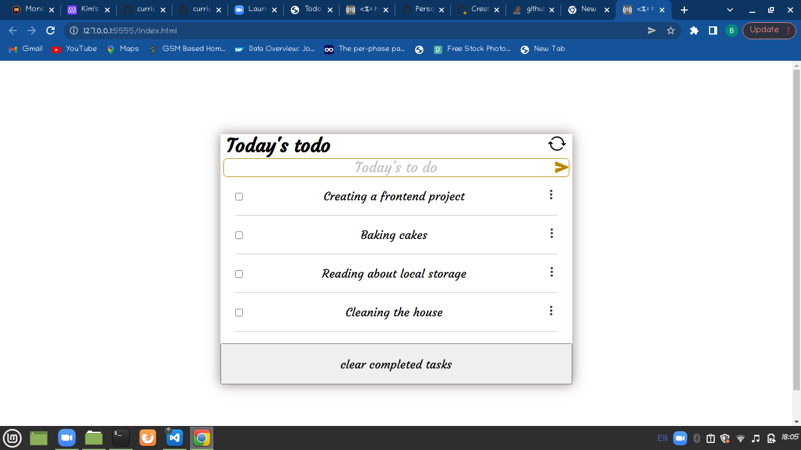

# todo list using jest:

It is a website which you can add tasks and mark them as completed

## Live Demo

[Live Demo Link](https://kimutai01.github.io/todo-list/)

## Built With

- HTML5
- CSS3
- Visual Studio Code
- Git & Github
  -Jest

## Getting Started

### Prerequisites

Any modern web browser will do.

### Setup

Follow the steps described before.

## Author

👤 **Kiprotich Kimutai**

- GitHub: [@Kimutai01](https://github.com/Kimutai01)
- Twitter: [@Kimutai_01](https://twitter.com/Kimutai_01?s=09)
- LinkedIn: [@kiprotichkimutai](https://www.linkedin.com/m/in/kimutai-kiprotich-1b5045216)

## 🤝 Contributing

Contributions, issues, and feature requests are welcome!

## Show your support

Give a ⭐️ if you like this project!

## Acknowledgments

- Hat tip to anyone whose code was used
- Inspiration
- Microverse program
- My code reviewers

## 📝 License

This project is [MIT](./MIT.md) licensed.
